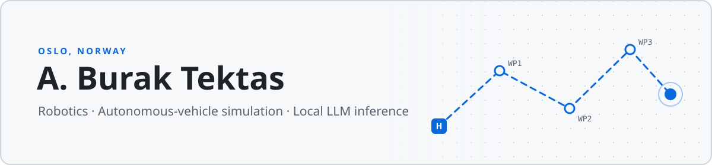

<picture>
  <source media="(prefers-color-scheme: dark)" srcset="assets/header-dark.svg">
  
</picture>

I'm Burak, based in Oslo. I contribute upstream to open-source robotics, autonomous-driving simulation and local LLM projects, mostly fixing correctness bugs, protocol edge cases and test gaps.

### Open-source contributions

<!-- CONTRIBUTIONS:START -->
**13** pull requests to **6** projects · ✅ 3 merged · ⏳ 10 in review

#### [MAVProxy](https://github.com/ArduPilot/MAVProxy)
MAVLink proxy and command-line ground station: console completion fixes.

- ⏳ [rline: don't let a short completion rule break the others](https://github.com/ArduPilot/MAVProxy/pull/1765) in review, opened Sep 29, 2026

#### [PX4 Autopilot](https://github.com/PX4/PX4-Autopilot)
Drone flight stack: fixed-wing Offboard and rover fixes.

- ⏳ [fix(fw_mode_manager): clear the course setpoint in Offboard](https://github.com/PX4/PX4-Autopilot/pull/28920) in review, opened Sep 29, 2026
- ⏳ [fix(rover): silence missing HIWONDER_EMM_EN on builds without the driver](https://github.com/PX4/PX4-Autopilot/pull/28887) in review, opened Sep 28, 2026

#### [CARLA](https://github.com/carla-simulator/carla)
Autonomous-driving simulator: Python API agents, examples and docs.

- ⏳ [docs: state that actor velocities use world coordinates](https://github.com/carla-simulator/carla/pull/9916) in review, opened Sep 29, 2026
- ⏳ [docs: update walker skeleton tutorial to the current bone API](https://github.com/carla-simulator/carla/pull/9915) in review, opened Sep 29, 2026
- ✅ [fix(agents): handle a missing incoming waypoint in BehaviorAgent](https://github.com/carla-simulator/carla/pull/9912) merged Sep 29, 2026
- ✅ [fix(python): honour --show-* flags in no_rendering_mode map cache](https://github.com/carla-simulator/carla/pull/9910) merged Sep 29, 2026

#### [ArduPilot](https://github.com/ArduPilot/ardupilot)
Drone flight stack: SITL autotests and HAL test fixes.

- ⏳ [autotest: fix and re-enable Plane.TerrainRally](https://github.com/ArduPilot/ardupilot/pull/34517) in review, opened Sep 27, 2026
- ⏳ [AP_HAL: fix DSP_test reading past the end of gyro_frames](https://github.com/ArduPilot/ardupilot/pull/34502) in review, opened Sep 25, 2026

#### [QGroundControl](https://github.com/mavlink/qgroundcontrol)
Ground control station: MAVLink COMMAND_INT support and mission command handling.

- ⏳ [fix(PX4): send DO_REPOSITION as COMMAND_INT when supported](https://github.com/mavlink/qgroundcontrol/pull/15187) in review, opened Sep 25, 2026
- ⏳ [fix(Vehicle): send DO_SET_HOME as COMMAND_INT when supported](https://github.com/mavlink/qgroundcontrol/pull/15186) in review, opened Sep 25, 2026
- ✅ [fix(MissionManager): restore mission commands lost to broken enum translations](https://github.com/mavlink/qgroundcontrol/pull/15185) merged Sep 29, 2026

#### [Ollama](https://github.com/ollama/ollama)
Local LLM runtime: MLX runner and Gemma 4 mixture-of-experts loading on Apple Silicon.

- ⏳ [mlxrunner: load gemma4 experts in the mlx-lm switch_glu layout](https://github.com/ollama/ollama/pull/18631) in review, opened Sep 24, 2026
<!-- CONTRIBUTIONS:END -->

Last updated Sep 29, 2026 by [GitHub Actions](.github/workflows/update-readme.yml)
